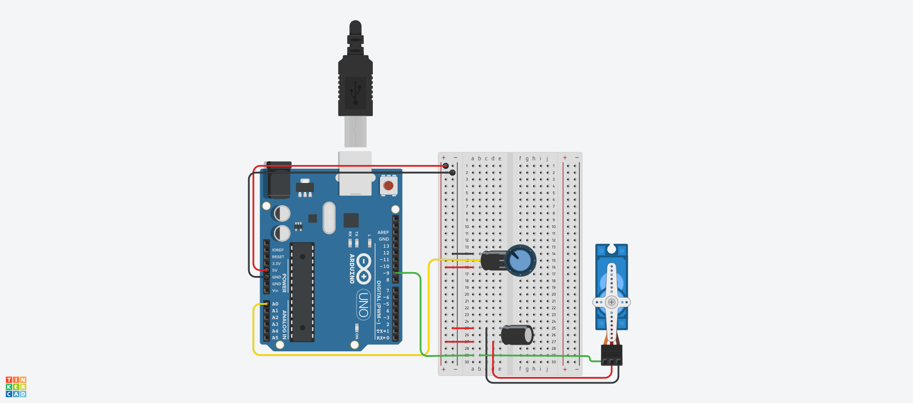

## Description
This project uses a potentiometer to control the position of a servo motor. 
The Arduino reads the analog input from the potentiometer, maps the value 
to a servo angle between 0° and 179°, and moves the servo accordingly. 
The raw sensor value and the mapped angle are displayed in the Serial Monitor for debugging.

## Wiring Diagram

## Components
- Arduino
- Breadboard
- Servo Motor + Motor Arm
- 2 x 100uF Capacitors
- Potentiometer
- 2 x Jumper Cables
- 6 x Misc Wires
- 3 x Male Header Pins (depending on connector configuration of Servo Motor)
